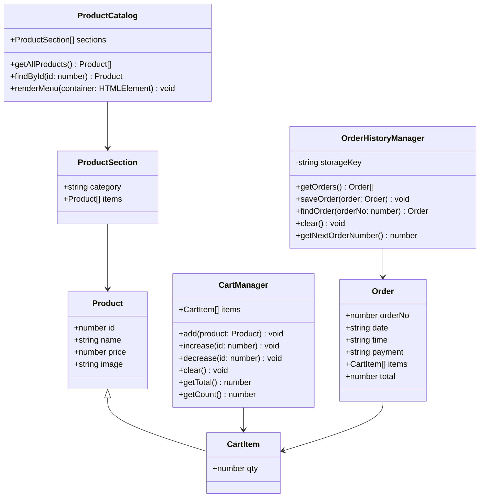

# ☕ JAFFEE — Modern Coffee Shop Point-of-Sale (POS) & Ordering Web App

[](https://www.typescriptlang.org/)
[](https://developer.mozilla.org/en-US/docs/Web/HTML)
[](https://developer.mozilla.org/en-US/docs/Web/CSS)
[](https://fontawesome.com/)
[](LICENSE)

> A modern, responsive, and interactive Coffee Shop Point-of-Sale (POS) and Online Ordering System built with **TypeScript**, **HTML5**, and **CSS3**. Features real-time cart calculations, category filtering, animated authentication modals, card/COD checkout validations, and persistent order history with 1-click reordering.

---

## 📑 Table of Contents

- [☕ JAFFEE — Modern Coffee Shop Point-of-Sale (POS) \& Ordering Web App](#-jaffee--modern-coffee-shop-point-of-sale-pos--ordering-web-app)
  - [📑 Table of Contents](#-table-of-contents)
  - [📖 Overview](#-overview)
  - [✨ Key Features](#-key-features)
    - [🛍️ 1. Dynamic Menu \& Smooth Category Filtering](#️-1-dynamic-menu--smooth-category-filtering)
    - [🛒 2. Interactive Slide-Out Cart System](#-2-interactive-slide-out-cart-system)
    - [💳 3. Comprehensive Checkout \& Form Validation](#-3-comprehensive-checkout--form-validation)
    - [🕒 4. Persistent Order History \& Quick Re-Order](#-4-persistent-order-history--quick-re-order)
    - [🔐 5. Sliding Authentication Modal](#-5-sliding-authentication-modal)
    - [📜 6. Store Policies Modal](#-6-store-policies-modal)
    - [📱 7. Responsive Design \& Accessibility](#-7-responsive-design--accessibility)
  - [🏛️ Architecture \& TypeScript OOP Design](#️-architecture--typescript-oop-design)
    - [TypeScript Data Contracts](#typescript-data-contracts)
  - [☕ Menu Catalog](#-menu-catalog)
  - [🛠️ Tech Stack](#️-tech-stack)
  - [📁 Project Directory Structure](#-project-directory-structure)
  - [🚀 Getting Started](#-getting-started)
    - [Prerequisites](#prerequisites)
    - [Installation \& Compilation](#installation--compilation)
    - [Running the Application](#running-the-application)
      - [Method 1: VS Code Live Server (Recommended)](#method-1-vs-code-live-server-recommended)
      - [Method 2: Node.js `npx serve`](#method-2-nodejs-npx-serve)
      - [Method 3: Python Built-In HTTP Server](#method-3-python-built-in-http-server)
  - [⌨️ User Experience \& Shortcuts](#️-user-experience--shortcuts)
  - [🔮 Roadmap \& Future Enhancements](#-roadmap--future-enhancements)
  - [🤝 Contributing](#-contributing)
  - [👨‍💻 Author](#-author)
  - [📄 License](#-license)

---

## 📖 Overview

**JAFFEE (`POS-TYPE`)** is an end-to-end frontend POS and digital ordering platform designed for specialty cafes and coffee shops. It bridges the gap between an elegant e-commerce ordering frontend and an operational point-of-sale system, enabling customers to explore artisanal blends and pastries, customize orders, securely enter payment details, and review past order receipts stored locally in the browser.

The entire business logic is written in strictly typed **TypeScript**, employing Object-Oriented Programming (OOP) paradigms with dedicated domain classes for catalog management, cart state mutations, and persistent order history.

---

## ✨ Key Features

### 🛍️ 1. Dynamic Menu & Smooth Category Filtering
- **Class-Driven Rendering**: Menu items are dynamically generated from strongly typed `ProductSection` datasets via the `ProductCatalog` class.
- **Categorized Offerings**:
  - ☕ *High Volume* (Espresso, Americano, Cappuccino, Cortado, Café Mocha)
  - 🧊 *Summer Favourites* (Iced Americano, Iced Latte, Affogato, Frappés)
  - 🍵 *Brews & Teas* (Matcha, Chai Latte, French Press, Hot Chocolate, Jasmine Green Tea)
  - 🥐 *Artisan Bakery* (Croissants, Blueberry Muffins, Cinnamon Rolls, Sourdough Avocado Toast)
- **Smooth Animations**: Animated category transitions with CSS `@keyframes` fade-out and fade-in effects.

### 🛒 2. Interactive Slide-Out Cart System
- **Real-Time Calculation**: Dynamic calculation of line item prices, order subtotal, and total item count badge on the navbar.
- **Granular Quantity Controls**: Increment (`+`) or decrement (`-`) item counts directly within the cart drawer with automatic cleanup when quantity reaches zero.
- **Live Visual Feedback**: Custom toast notifications for item additions and updates.

### 💳 3. Comprehensive Checkout & Form Validation
- **Dual Payment Modes**:
  - **Credit / Debit Card**: Includes real-time input formatting (`0000-0000-0000-0000`), expiration date formatting (`MM/YY`), live expiration date validation (month `01-12`, past date checks), and 3-digit CVV validation.
  - **Cash on Delivery (COD)**: Seamlessly toggles card input visibility and displays relevant delivery terms.
- **Delivery Calculation**: Automatically incorporates fixed delivery charges (`Rs. 250`) into the final checkout summary.
- **Form Sanitization**: Number sanitization on 5-digit postal codes and regex validation on customer email addresses.
- **Empty Cart Guard**: Prevents checkout attempts if the cart contains no items.

### 🕒 4. Persistent Order History & Quick Re-Order
- **LocalStorage Persistence**: Orders are serialized into browser `localStorage` under `orderHistory`.
- **Order Tracking**: Sequential order numbering starting from `#1001`, with order timestamps (date and time), payment method used, item breakdown, and grand total.
- **Repeat Order Feature**: 1-click re-order button that automatically repopulates the cart with items from any previous order.
- **History Management**: Includes ability to clear previous order records with toast feedback.

### 🔐 5. Sliding Authentication Modal
- **Interactive Switcher**: Smooth sliding transitions between Login and Register views with responsive container height adjustments.
- **Client-Side Validation**: Username, valid email format regex, password length check ($\ge 6$ characters), and Terms & Conditions agreement checkbox.

### 📜 6. Store Policies Modal
- Tabbed interface for reviewing store **Terms & Conditions** and **Privacy Policy** (ordering terms, cancellation policies, delivery estimates, refunds, and data handling).

### 📱 7. Responsive Design & Accessibility
- **Mobile Optimized**: Custom mobile navigation drawer with hamburger toggle.
- **Keyboard Shortcut (`Escape` key)**: Pressing `Esc` automatically closes any active overlay, popup, cart drawer, mobile menu, or modal.

---

## 🏛️ Architecture & TypeScript OOP Design

The project's codebase follows clean architectural separation and object-oriented principles:



### TypeScript Data Contracts
- [`Product`](file:///d:/POS-TYPE/jaffeetype.ts#L6-L11): Defines individual coffee or bakery items.
- [`ProductSection`](file:///d:/POS-TYPE/jaffeetype.ts#L14-L17): Groups products under categories.
- [`CartItem`](file:///d:/POS-TYPE/jaffeetype.ts#L20-L22): Extends `Product` with ordered quantity (`qty`).
- [`Order`](file:///d:/POS-TYPE/jaffeetype.ts#L25-L32): Represents completed transactions with sequential IDs, timestamps, payment info, items array, and grand total.

---

## ☕ Menu Catalog

| Category | Item Name | Price (PKR) | Type |
| :--- | :--- | :--- | :--- |
| **High Volume** | Espresso | Rs. 765 | Hot Coffee |
| **High Volume** | Americano | Rs. 1,050 | Hot Coffee |
| **High Volume** | Cappuccino | Rs. 1,250 | Hot Coffee |
| **High Volume** | Cortado | Rs. 1,100 | Hot Coffee |
| **High Volume** | Café Mocha | Rs. 1,460 | Hot Coffee |
| **Summer Favourites** | Iced Americano | Rs. 1,100 | Cold Coffee |
| **Summer Favourites** | Iced Latte | Rs. 1,320 | Cold Coffee |
| **Summer Favourites** | Affogato | Rs. 1,550 | Dessert Coffee |
| **Summer Favourites** | Caramel Frappé | Rs. 1,600 | Blended Beverage |
| **Summer Favourites** | Matcha Frappé | Rs. 1,460 | Blended Beverage |
| **Brews & Teas** | Matcha Latte | Rs. 1,400 | Tea / Specialty |
| **Brews & Teas** | Chai Tea Latte | Rs. 1,400 | Tea / Specialty |
| **Brews & Teas** | French Press | Rs. 1,100 | Manual Brew |
| **Brews & Teas** | Hot Chocolate | Rs. 1,200 | Beverage |
| **Brews & Teas** | Jasmine Green Tea | Rs. 975 | Tea |
| **Artisan Bakery** | Butter Croissant | Rs. 1,050 | Bakery |
| **Artisan Bakery** | Almond Croissant | Rs. 1,250 | Bakery |
| **Artisan Bakery** | Blueberry Muffin | Rs. 1,100 | Bakery |
| **Artisan Bakery** | Cinnamon Roll | Rs. 1,250 | Bakery |
| **Artisan Bakery** | Sourdough Avocado Toast | Rs. 2,360 | Breakfast / Savory |

---

## 🛠️ Tech Stack

- **Language**: [TypeScript](https://www.typescriptlang.org/) (Static Typing, ES6+ Output)
- **Markup**: [HTML5](https://developer.mozilla.org/en-US/docs/Web/HTML) (Semantic elements, modals, embedded video)
- **Styling**: [CSS3](https://developer.mozilla.org/en-US/docs/Web/CSS) (Flexbox, CSS Grid, Media Queries, Custom Keyframes)
- **Typography & Icons**:
  - Fonts: [Syne Font](https://fonts.cdnfonts.com/css/syne)
  - Icons: [Font Awesome 6](https://cdnjs.cloudflare.com/ajax/libs/font-awesome/6.0.0/css/all.min.css) & [Boxicons 2.1.4](https://unpkg.com/boxicons@2.1.4/css/boxicons.min.css)
- **State & Storage**: Browser Web Storage API (`localStorage`)
- **Tooling**: Visual Studio Code, Live Server (`port: 5501`), `tsc` (TypeScript Compiler)

---

## 📁 Project Directory Structure

```text
POS-TYPE/
├── .vscode/
│   └── settings.json          # Live Server configuration (Port: 5501)
├── images/                    # Product photography, logo & video assets
│   ├── Affogato-removebg-preview.png
│   ├── Almond_Croissant-removebg-preview.png
│   ├── Americano-removebg-preview.png
│   ├── Blueberry_Muffin-removebg-preview.png
│   ├── Butter_Croissant-removebg-preview.png
│   ├── Café_Mocha-removebg-preview.png
│   ├── Cappuccino-removebg-preview.png
│   ├── Caramel_Frappé-removebg-preview.png
│   ├── Chai_Tea_Latte-removebg-preview.png
│   ├── Cinnamon_Roll-removebg-preview.png
│   ├── Cortado-removebg-preview.png
│   ├── espresso-removebg-preview.png
│   ├── Free-delivery.png
│   ├── french-press-removebg-preview.png
│   ├── Hot_Chocolate-removebg-preview.png
│   ├── Iced_Americano-removebg-preview.png
│   ├── Iced_Latte-removebg-preview.png
│   ├── jaffee-title-removebg-preview (1).png
│   ├── jaffeelogo1.png
│   ├── Jasmine_Green_Tea-removebg-preview.png
│   ├── Matcha_Frappé-removebg-preview.png
│   ├── Matcha_Latte-removebg-preview.png
│   ├── Sourdough_Avocado_Toast-removebg-preview.png
│   └── coffee-video.mp4       # Autoplaying background presentation video
├── jaffeetype.html            # Main markup, header, menu grid, and modals
├── jaffeetype.css             # Comprehensive styles, layouts, and animations
├── jaffeetype.ts              # Core TypeScript application logic & state
├── jaffeetype.js              # Compiled JavaScript output (generated via tsc)
└── README.md                  # Project documentation & GitHub showcase
```

---

## 🚀 Getting Started

### Prerequisites

Ensure you have the following installed on your machine:
- **Node.js** (v16 or higher recommended): [Download Node.js](https://nodejs.org/)
- **TypeScript Compiler (`tsc`)**:
  ```bash
  npm install -g typescript
  ```
- Any modern web browser (Google Chrome, Microsoft Edge, Mozilla Firefox, Safari).

---

### Installation & Compilation

1. **Clone the repository**:
   ```bash
   git clone https://github.com/your-username/POS-TYPE.git
   cd POS-TYPE
   ```

2. **Compile TypeScript**:
   To compile `jaffeetype.ts` to `jaffeetype.js`:
   ```bash
   tsc jaffeetype.ts
   ```

   To run the compiler in **watch mode** during active development:
   ```bash
   tsc -w jaffeetype.ts
   ```

---

### Running the Application

You can preview the application using any of the following methods:

#### Method 1: VS Code Live Server (Recommended)
1. Open the `POS-TYPE` folder in Visual Studio Code.
2. Ensure the [Live Server](https://marketplace.visualstudio.com/items?itemName=ritwickdey.LiveServer) extension is installed.
3. Click **"Go Live"** in the bottom status bar, or right-click `jaffeetype.html` and select **"Open with Live Server"**.
4. The app will launch on `http://127.0.0.1:5501/jaffeetype.html` (port pre-configured in `.vscode/settings.json`).

#### Method 2: Node.js `npx serve`
```bash
npx serve .
```

#### Method 3: Python Built-In HTTP Server
```bash
# Python 3
python -m http.server 5501
```
Open your browser and navigate to `http://localhost:5501/jaffeetype.html`.

---

## ⌨️ User Experience & Shortcuts

- **`Esc` (Escape Key)**: Instantly dismisses any open modal overlay (Cart drawer, Login/Register popup, Checkout modal, Order History modal, Policies modal, or Mobile Menu).
- **Cart Counter Badge**: Live counter displays the total quantity of items currently selected.
- **Repeat Order**: In the Order History drawer, click "Repeat Order" on any past ticket to reload all items directly into your active cart.
- **Direct Filtering from Footer**: Clicking any menu category link in the footer automatically scrolls smoothly to the menu and filters items for that category.

---

## 🔮 Roadmap & Future Enhancements

- [ ] **Backend API Integration**: Connect to an Express.js / NestJS REST or GraphQL backend.
- [ ] **Database Persistence**: Replace `localStorage` with MongoDB or PostgreSQL for persistent cloud storage.
- [ ] **Real Payment Gateway**: Integrate Stripe, PayPal, JazzCash, or EasyPaisa APIs.
- [ ] **Kitchen Display System (KDS)**: Add real-time order status tracking (`Received` ➔ `Preparing` ➔ `Ready` ➔ `Delivered`).
- [ ] **Thermal Receipt Printing**: Generate and print standardized 80mm POS receipts.
- [ ] **Admin Inventory Panel**: Allow cafe managers to add, update, or remove menu items and modify stock levels.

---

## 🤝 Contributing

Contributions, issues, and feature requests are welcome!

1. Fork the Project (`https://github.com/your-username/POS-TYPE/fork`)
2. Create your Feature Branch (`git checkout -b feature/AmazingFeature`)
3. Commit your Changes (`git commit -m 'Add some AmazingFeature'`)
4. Push to the Branch (`git push origin feature/AmazingFeature`)
5. Open a Pull Request

---

## 👨‍💻 Author

**Fakhir Asghar**
- GitHub: [@Fakhir05](https://github.com/Fakhir05)
- Repository: [Fakhir05/JAFFEE-TYPESCRIPT](https://github.com/Fakhir05/JAFFEE)

---

## 📄 License

Distributed under the **MIT License**. See `LICENSE` for more information.

---

<p align="center">
  Crafted with ☕ and passion for great coffee & clean code.
</p>

